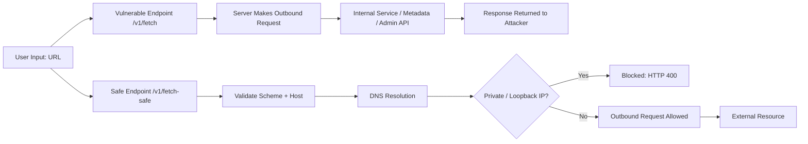

# Python SSRF Demo (FastAPI)

## Overview

This repository demonstrates a **Server-Side Request Forgery (SSRF)** vulnerability in a Python **FastAPI** application, along with a **defensible, production-style remediation**.

The goal is not to showcase a scanner finding, but to show:

- how SSRF occurs in real applications
- how it can be exploited
- how to fix it correctly
- how to prevent regression with tests and CI guardrails

This mirrors how SSRF issues are handled in real-world **Application Security** work.

---

## What This Demonstrates

- ✅ A vulnerable endpoint that allows user-controlled outbound requests  
- ✅ How SSRF can be used to access internal-only services  
- ✅ A secure implementation that blocks private and internal targets  
- ✅ Regression tests that prove the fix works  
- ✅ Semgrep SAST rules to prevent reintroduction  

---

## Vulnerability: Server-Side Request Forgery (SSRF)

SSRF occurs when an application makes outbound requests using **user-supplied URLs**
without validating where those requests are allowed to go.

### Why This Is Dangerous

SSRF can allow attackers to:

- Access internal services not exposed to the internet
- Query cloud metadata services (credentials, tokens)
- Pivot into internal networks
- Bypass network segmentation

### OWASP Top 10 Mapping

- **A10 – Server-Side Request Forgery (2021)**
- **A04 – Insecure Design** (root cause)

---

## Vulnerable Endpoint

```http
GET /v1/fetch?url=http://example.com
Vulnerable Behavior

The application:

Accepts an arbitrary url parameter

Makes an outbound HTTP request directly

Performs no validation on scheme, host, or destination IP

Example Exploit
GET /v1/fetch?url=http://localhost/internal/secret
Mitigations Applied

The secure implementation enforces:

✅ Only http / https schemes allowed

✅ Hostname required

✅ Explicit blocking of localhost

✅ DNS resolution of target host

✅ Rejection of:

private IPs

loopback addresses

link-local ranges

reserved IP ranges

✅ Redirects disabled to prevent bypass

Validation occurs before any outbound request is made.

Why This Fix Is Correct

## Request Flow Comparison



This approach:

Prevents access to internal services

Blocks common SSRF bypass techniques

Does not rely on fragile allowlists alone

Is testable and enforceable in CI

This reflects real AppSec remediation, not a superficial patch.

Note: In production, SSRF defense should be implemented at multiple layers (app-level validation + egress controls + service allowlists). This demo focuses on the application-layer controls that an AppSec engineer can enforce in code review and CI.

Regression Tests

Tests demonstrate both behaviors:

✅ Vulnerable endpoint allows SSRF

✅ Secure endpoint blocks internal targets

This ensures:

The vulnerability is reproducible

The fix is provably effective

Future changes cannot silently reintroduce SSRF

CI & Guardrails

This repository includes:

Pytest regression tests

Semgrep SAST rules

GitHub Actions CI pipeline

Every commit:

runs tests

scans for SSRF patterns

blocks unsafe changes before merge

This is how AppSec scales beyond one-off fixes.

Running Locally

```bash
python -m venv .venv
# Windows:
.venv\Scripts\activate
pip install -r requirements.txt
pytest -q
uvicorn app.main:app --reload
```


Then visit:

http://localhost:8000/docs for interactive API testing

Key Takeaway

This project demonstrates the full AppSec lifecycle:

Identify a real vulnerability

Prove impact with exploitation

Apply a correct, defensible fix

Prevent recurrence with tests and automation

This is the difference between finding bugs and doing Application Security.

Author

Chris Heintzelman
Application Security Engineer
GitHub: https://github.com/cheintzelman141